<p align="center">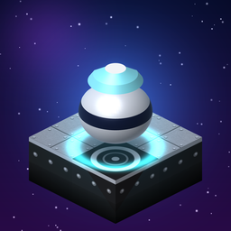</p>

<h1 align="center">Orictron</h1>

<p align="center"><b>The Oric Atmos Quazatron</b>, for iOS/iPadOS, Android, macOS and Windows, made with MonoGame.</p>

<p align="center">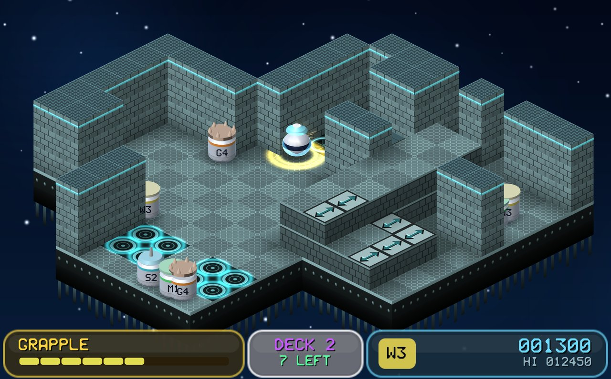</p>

A ship drifts through space, overrun by rogue droids. You are the influence device, a small robot that
can take over any droid's body. Shoot them, ram them, or grapple one and win the transfer battle to
make it yours, then clear all six decks.

Orictron is the Oric Atmos version of Graftgold's 1986 ZX Spectrum game *Quazatron* (published by
Hewson). This app has it two ways, and you can switch between them at any time, even mid-game:

- **ENHANCED** (the default): the decks are real 3D geometry seen through the original's isometric
  projection, with lighting, glowing pads and energisers, 3D droids with floating lids, shadows,
  particle explosions, smooth scrolling at the display's refresh rate, a glass status panel after the
  original's three capsules, a neon transfer battle, and new synthesised sound effects and music.
- **ORIGINAL**: the Oric version's own look and sound, recreated natively (no emulation). Its decks,
  droid sprites, font, status panel and screens are drawn from the Oric game's graphics data by a C#
  port of its drawing code, and its sound effects are played by a small square-wave synth.

Both looks run the same game: a line-by-line C# port of the Oric version's rules.

## Screenshots

<table>
<tr>
<td width="50%">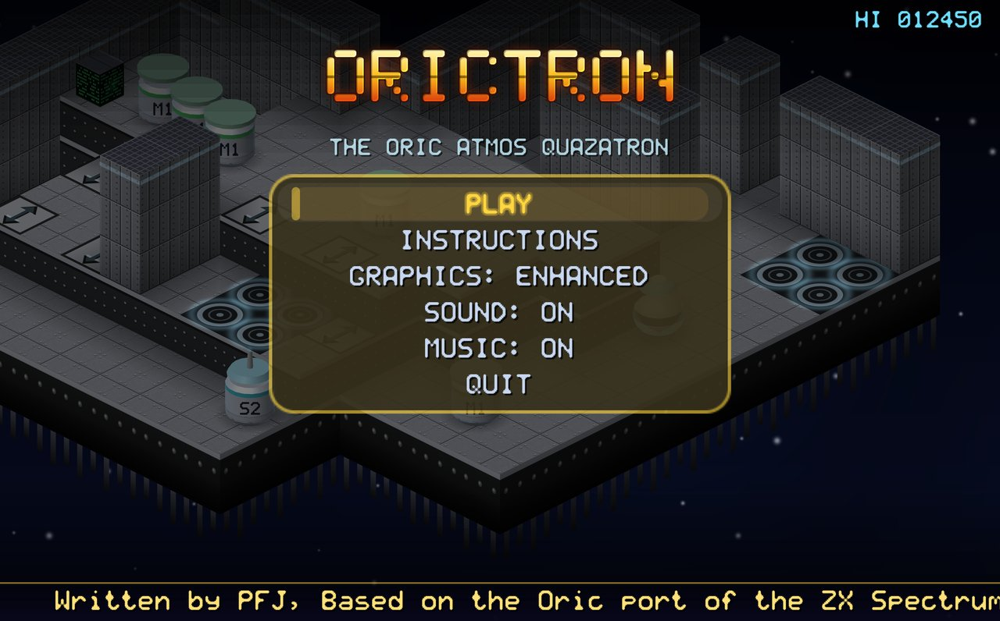<br><sub><b>The title</b>, over a live demo game. The credits scroll along the bottom.</sub></td>
<td width="50%">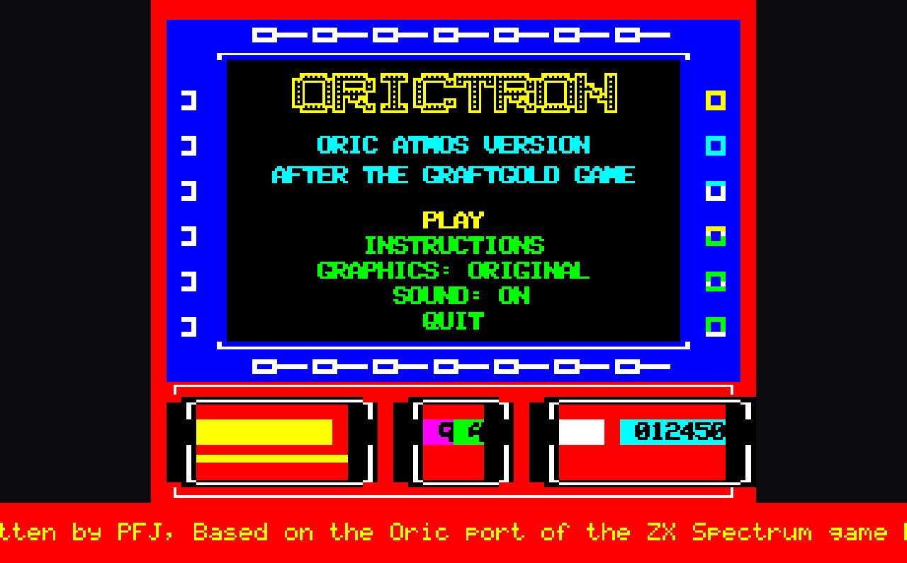<br><sub><b>The same title in the ORIGINAL look</b>: the Oric version's framed screen and red status panel.</sub></td>
</tr>
<tr>
<td>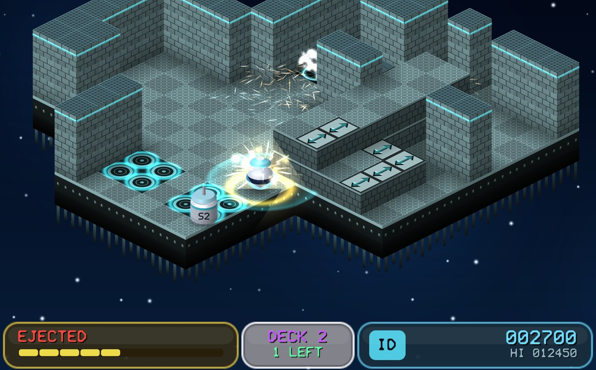<br><sub><b>Combat</b>: shoot, ram or grapple 52 droids in nine classes.</sub></td>
<td>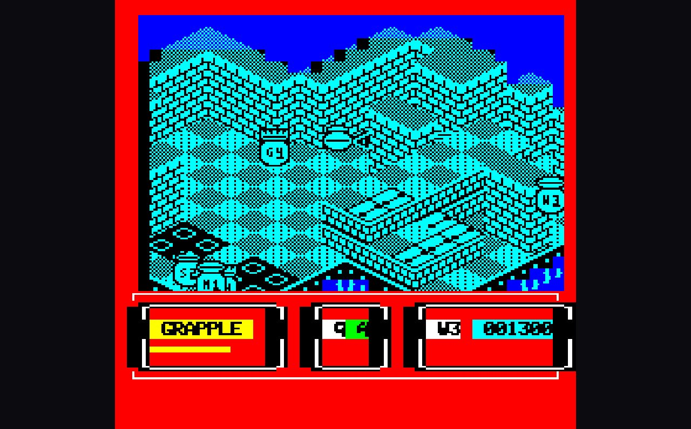<br><sub><b>ORIGINAL look</b>: eight colours, chunky pixels and chip sound, as on the Oric.</sub></td>
</tr>
<tr>
<td>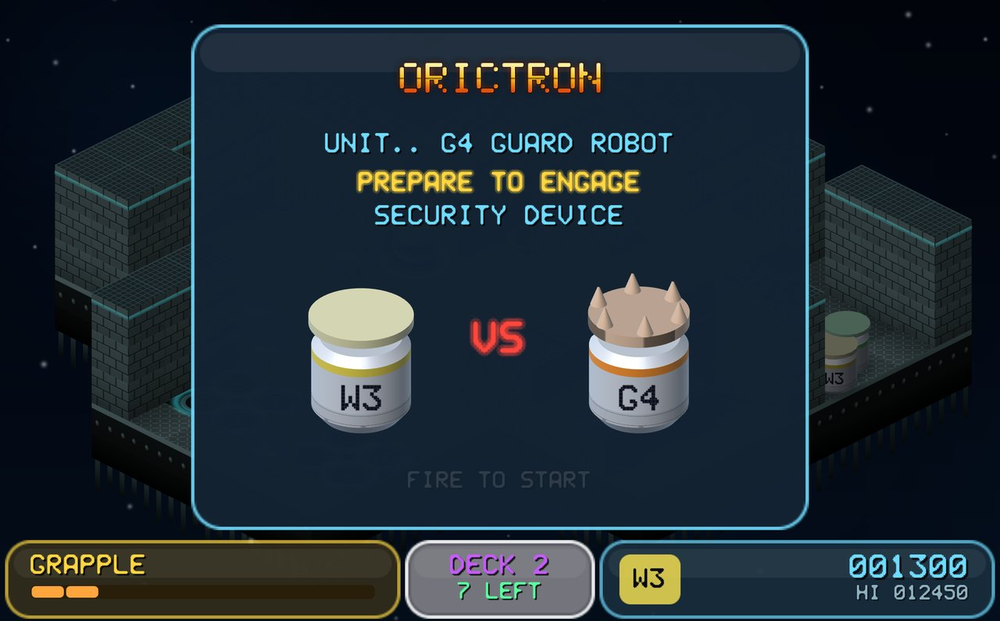<br><sub><b>Grapple a droid</b> and prepare to engage its security device.</sub></td>
<td>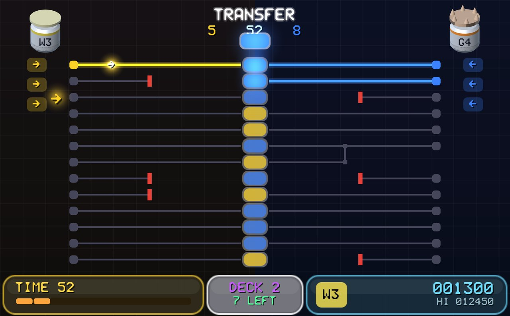<br><sub><b>The transfer battle</b>: fire pulses down the wires and hold more cells than the droid to take it over.</sub></td>
</tr>
<tr>
<td>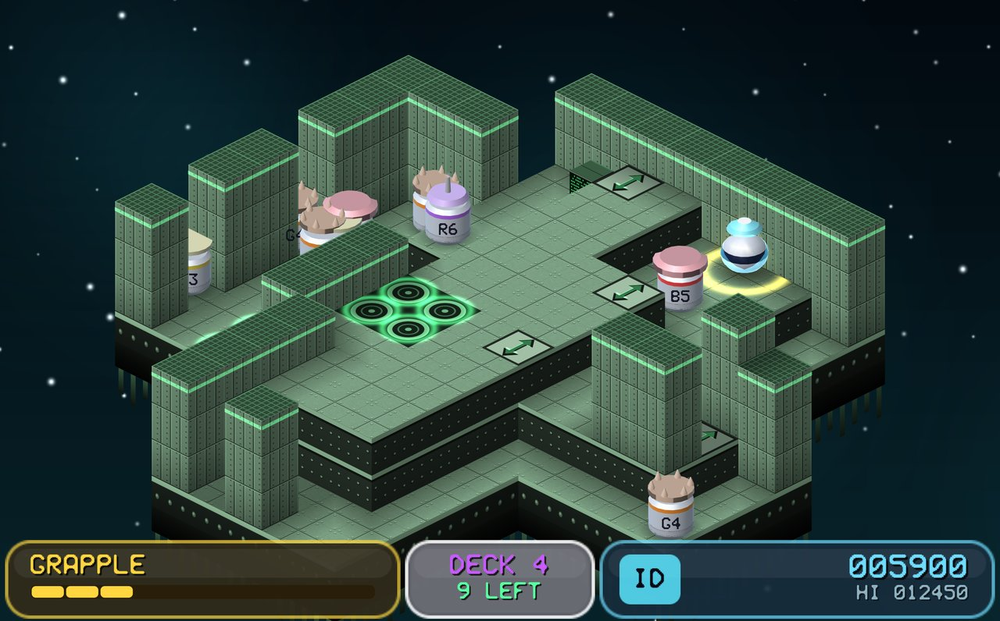<br><sub><b>Deeper decks</b>, each in its own colour, with tougher droids.</sub></td>
<td>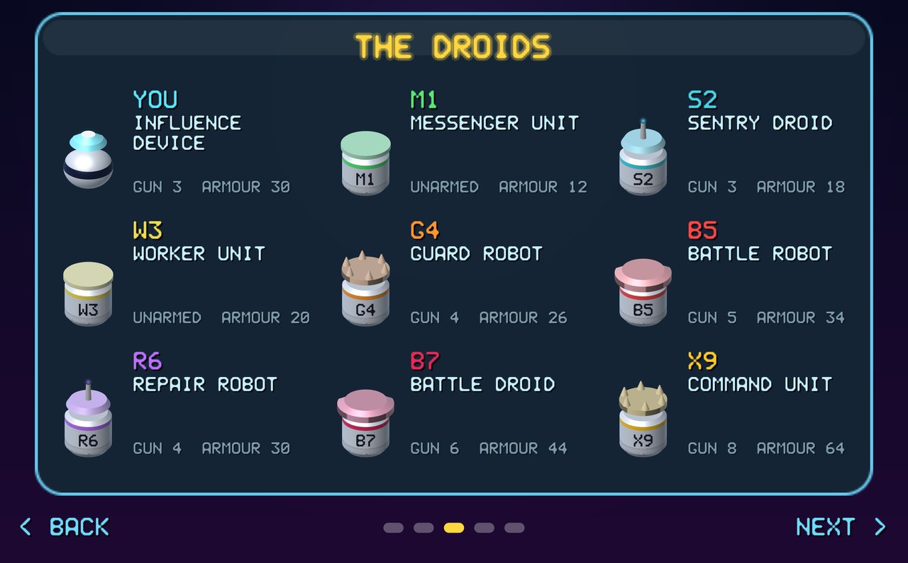<br><sub><b>Instructions</b> built in, including all nine droid classes.</sub></td>
</tr>
</table>

<p align="center">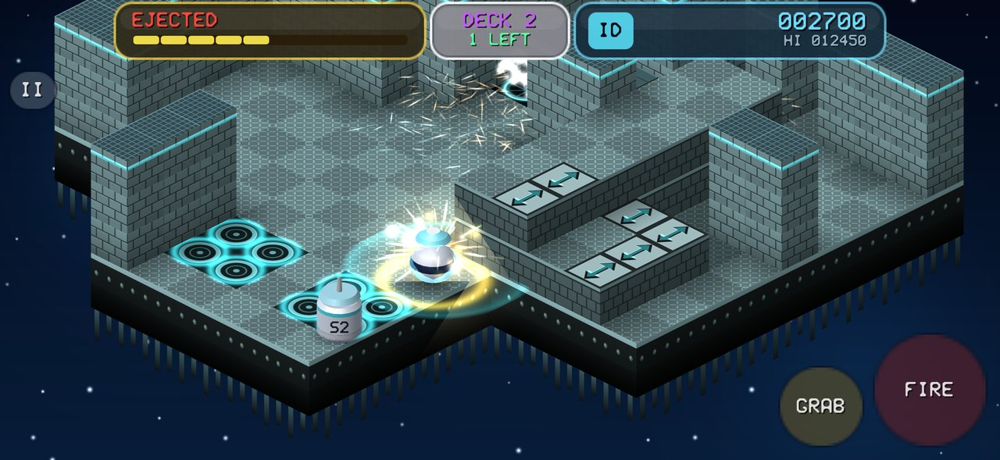<br>
<sub><b>On iPhone and Android</b>: tilt to move, with FIRE and GRAB buttons (LIFT appears on the lift hatch).</sub></p>

## Playing

| | Keyboard | Gamepad | Phone / tablet |
|---|---|---|---|
| Move (screen directions) | Arrows or Q A O P | Stick / D-pad | Tilt (or the on-screen D-pad) |
| Fire | SPACE | A | FIRE |
| Grapple | T or RETURN, or hold SPACE standing still | X | GRAB |
| Lift | L (on the hatch) | Y | LIFT |
| Pause | ESC | START | II |
| Enhanced / original | G, or GRAPHICS on the title or pause menu | | GRAPHICS menu line |
| Full screen | F11 | | |

Your five best scores are saved on the device and kept between sessions. See
[docs/PLAYING.md](docs/PLAYING.md) for the rules.

| | |
|---|---|
| Identifiers | Apple and Android `uk.co.allthejohnsons.quazitronic` |
| Version | 1.0.0 (build 1), set in `Directory.Build.props` |

## Repository layout

```
src/Quazitronic.Core      Shared code: the game, both renderers, audio, screens, input, saves
src/Quazitronic.Desktop   Windows + macOS head (MonoGame DesktopGL)
src/Quazitronic.Android   Android head (+ tilt sensor)
src/Quazitronic.iOS       iOS/iPadOS head (+ CoreMotion tilt)
tests/Quazitronic.Tests   xUnit: rules, transfer, decks, original screen, sound, tilt, saves, audio, UI
tools/                 Capture tool (store stills, videos, icon), icon/store/copy scripts, deck and graphics export
build/                 Release script, macOS bundle files, Windows MSIX manifest and tiles
art/                   Master icon (rendered by the game) and generated icon files
docs/                  Architecture, building, releasing, playing, screenshots
```

Not in git: `oricport/` (the Oric original's source), `releases/`, `stores/`, `artifacts/` and
`signing/` (signing keys and personal account settings; see `build/*.example`).

## Quick start

```bash
dotnet run --project src/Quazitronic.Desktop      # play on Mac/Windows
dotnet test tests/Quazitronic.Tests                # unit tests
build/build-release.sh all                      # release packages -> releases/
```

See [docs/ARCHITECTURE.md](docs/ARCHITECTURE.md), [docs/BUILDING.md](docs/BUILDING.md) and
[docs/RELEASING.md](docs/RELEASING.md).

## Licence

Written by PFJ, based on the Oric port of the ZX Spectrum game by Hewson. Released under the
[DILLIGAF License](LICENSE): do what you like with the code.

Quazatron is © 1986 Graftgold / Hewson Consultants. Orictron is an unofficial tribute: it contains
none of their code or graphics.
